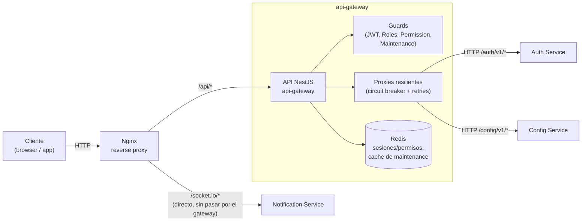

# Contenedores del API Gateway

## Contenedores principales

- **API NestJS** (`api-gateway`) — sin base de datos propia; punto único de entrada, valida JWT/rol/permisos, aplica rate limiting y modo mantenimiento, y reenvía a los servicios internos.
- **Redis** — usado para validar sesiones/permisos (`JwtSessionGuard`) y cachear el estado de mantenimiento consultado a `config-service` (30s TTL).
- **Proxies resilientes** — `AuthProxy` y `ConfigProxy`, cada uno con su propio circuit breaker (opossum) vía `ResilientHttpClient`.

## Nota sobre el WebSocket de notificaciones

`notification-service` expone su WebSocket en `/socket.io/` directamente vía
Nginx, sin pasar por el gateway — ver [../architecture/api-gateway.md](../architecture/api-gateway.md) y [../architecture/notification-service.md](../architecture/notification-service.md).

Ver [../architecture/api-gateway.md](../architecture/api-gateway.md) para el detalle de capas y responsabilidades.
