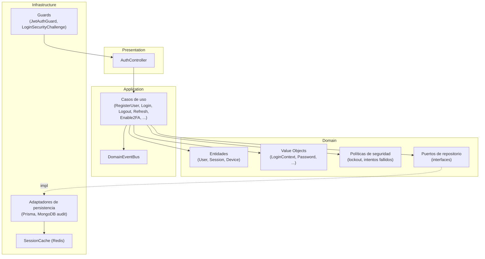

# Componentes del Auth Service

## Componentes internos

- **Controllers** — capa de presentación, valida entrada (DTOs + `ValidationPipe`) y delega en casos de uso.
- **Casos de uso** — orquestan reglas de negocio: registro, login, logout, refresh de tokens, 2FA, etc. No conocen detalles de infraestructura (Prisma, Redis), solo los puertos (interfaces) que el dominio define.
- **Entidades de dominio** — `User`, `Session`, `Device`: agregan invariantes de negocio.
- **Value Objects** — `LoginContext`, `Password`, etc.: validan y encapsulan datos primitivos con reglas propias.
- **Políticas de seguridad** — lockout por intentos fallidos, validación de dispositivo.
- **Repositorios** — puertos (interfaces) en el dominio, implementados en infraestructura contra Prisma/MongoDB.
- **Bus de eventos** — `DomainEventBus` desacopla efectos secundarios (ej. auditoría en `LogoutEvent`) de los casos de uso.

Ver [../flows/login-flow.md](../flows/login-flow.md) y [../flows/register-flow.md](../flows/register-flow.md) para el recorrido completo de estos componentes en los flujos principales.
