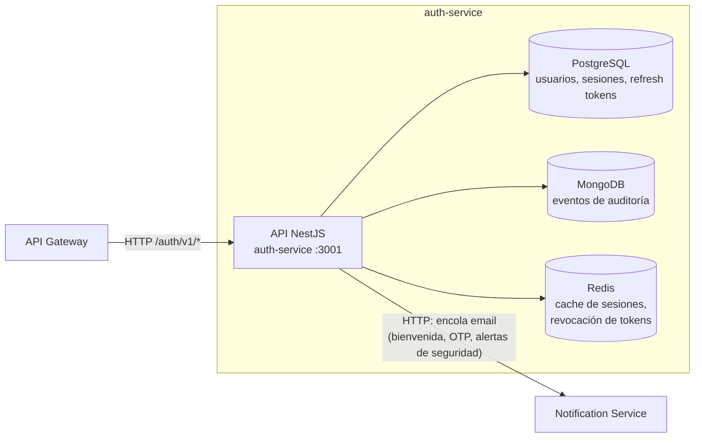

# Contenedores del Auth Service

## Contenedores principales

- **API NestJS** — arquitectura hexagonal (domain / application / infrastructure), expone `/auth/v1/*`.
- **PostgreSQL** (`auth-postgres`) — persistencia transaccional de usuarios, dispositivos, sesiones y refresh tokens (vía Prisma).
- **MongoDB** — registro de auditoría de eventos de seguridad (login, logout, intentos fallidos, cambios de contraseña).
- **Redis** — cache de sesiones activas y lista de revocación de tokens, para invalidación inmediata sin esperar expiración natural del JWT.

El servicio se comunica con el API Gateway mediante HTTP (el gateway es su único cliente directo — de ahí `trust proxy: 1` en `main.ts`), y con el Notification Service para disparar emails transaccionales.
