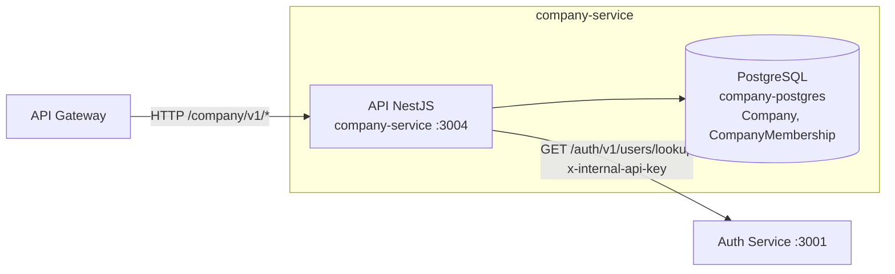

# Contenedores del Company Service

## Contenedores principales

- **API NestJS** — expone `/company/v1/*`: crear/consultar empresa, invitar/listar/actualizar miembros.
- **PostgreSQL** (`company-postgres`) — instancia dedicada, separada de `auth-postgres`/`config-postgres`, vía Prisma.

Sin MongoDB ni Redis en este primer corte (sin audit log ni cache todavía —
decisión deliberada, ver [../architecture/company-service.md](../architecture/company-service.md)).

## Consumidores

- **API Gateway** — `CompanyProxy` reenvía `/v1/companies/*` (mismo patrón circuit-breaker que `AuthProxy`).

## Dependencias salientes

- **Auth Service** — `GET /auth/v1/users/lookup?email=` para resolver el `userId` al invitar un miembro (llamada síncrona, con `x-internal-api-key`).

## Controllers

- `CompanyController` — `POST /companies`, `GET /companies/:id`.
- `CompanyMembershipController` — `POST /companies/:id/members`, `GET /companies/:id/members`, `PATCH /companies/:id/members/:membershipId`.
