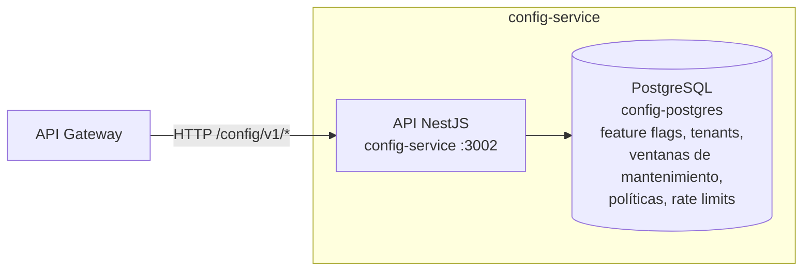

# Contenedores del Config Service

## Contenedores principales

- **API NestJS** — expone `/config/v1/*`: feature flags, modo mantenimiento (con ventanas programadas), tenants, reglas de IP, políticas de contraseña y rate limits configurables.
- **PostgreSQL** (`config-postgres`) — instancia dedicada, separada de `auth-postgres`, vía Prisma.

## Consumidores

- **API Gateway** — es el principal consumidor: `MaintenanceGuard` consulta `/config/v1/maintenance/status` en cada request (con cache en Redis de 30s) para decidir si la plataforma está en mantenimiento. Ver [../flows/maintenance-mode-flow.md](../flows/maintenance-mode-flow.md).

## Controllers

- `FeatureFlagController` — activar/desactivar features sin redesplegar.
- `MaintenanceController` — estado de mantenimiento, activar/desactivar, programar y cancelar ventanas de mantenimiento.
- `StatsController` — estadísticas del sistema.
