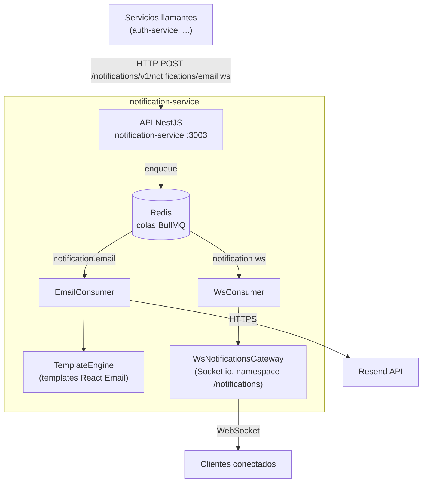

# Contenedores del Notification Service

## Contenedores principales

- **API NestJS** — expone endpoints para _encolar_ trabajo (`POST /notifications/email`, `POST /notifications/ws`) — la respuesta es inmediata (`202 Accepted`), el envío real es asíncrono.
- **Redis** — backend de las colas BullMQ (`notification.email`, `notification.ws`).
- **Consumers** — workers que procesan los jobs con reintentos y backoff exponencial (ver [../flows/notification-flows.md](../flows/notification-flows.md)).
- **Resend API** (externo) — proveedor de envío de emails transaccionales.
- **Socket.io Gateway** — namespace `/notifications`; autentica al cliente vía cookie `accessToken` (JWT) en el handshake y lo une a una sala privada `user:<id>`.

## Por qué colas en vez de envío síncrono

Desacopla al llamante (ej. auth-service tras un registro) de la disponibilidad de Resend/websockets: si el proveedor de email falla momentáneamente, el job reintenta con backoff sin bloquear ni fallar la operación que lo originó.
