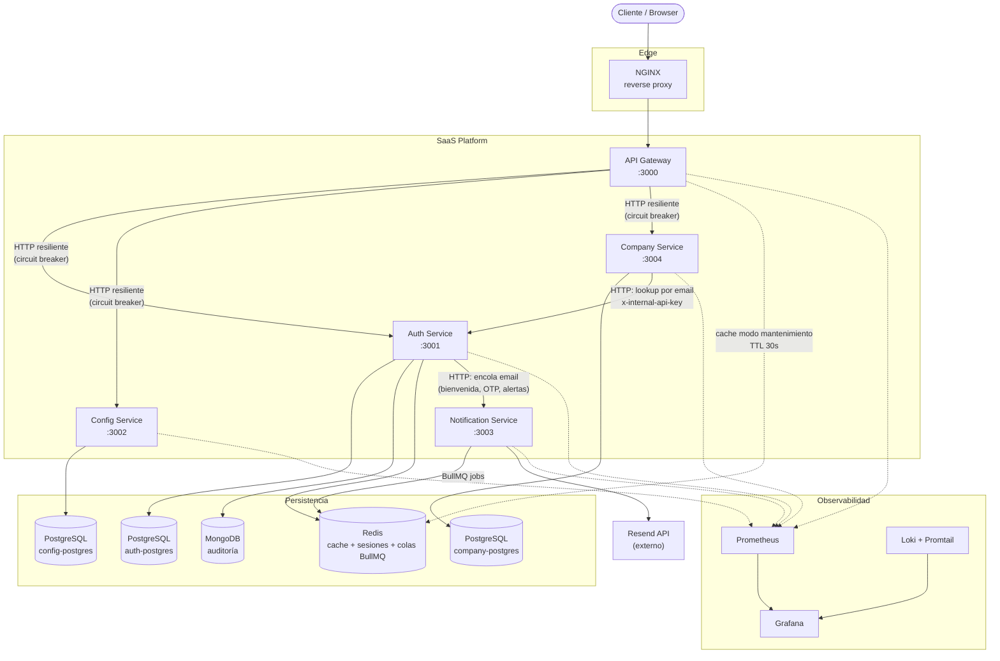

# Diagrama de Contenedores del Sistema

## Contenedores por servicio

| Servicio             | Puerto | Base de datos                                      | Cache/colas                                                   |
| -------------------- | ------ | -------------------------------------------------- | ------------------------------------------------------------- |
| api-gateway          | 3000   | —                                                  | Redis (cache de estado de mantenimiento)                      |
| auth-service         | 3001   | PostgreSQL (`auth-postgres`) + MongoDB (auditoría) | Redis (sesiones, revocación de tokens)                        |
| config-service       | 3002   | PostgreSQL (`config-postgres`)                     | —                                                             |
| notification-service | 3003   | —                                                  | Redis (colas BullMQ: `notification.email`, `notification.ws`) |
| company-service      | 3004   | PostgreSQL (`company-postgres`)                    | —                                                             |

Cada servicio es independientemente desplegable (`Dockerfile.dev` / `Dockerfile.prod` propios) y se orquesta en desarrollo con [docker/docker-compose.dev.yml](../../docker/docker-compose.dev.yml).

Ver también:

- [auth-containers.md](auth-containers.md) — detalle interno de auth-service
- [config-service-containers.md](config-service-containers.md) — detalle interno de config-service
- [notification-service-containers.md](notification-service-containers.md) — detalle interno de notification-service
- [company-service-containers.md](company-service-containers.md) — detalle interno de company-service
- [../flows/service-communication.md](../flows/service-communication.md) — cómo se comunican entre sí (HTTP resiliente, colas, cache)
