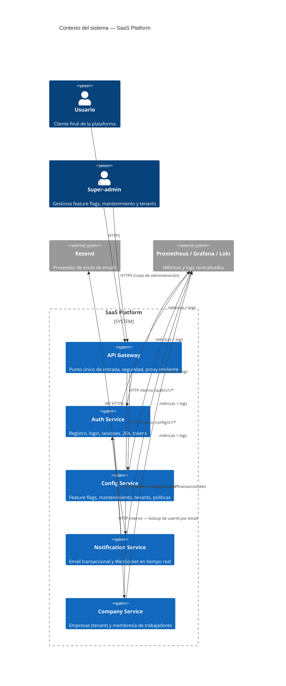

# Diagrama de Contexto del Sistema

## Actores

- **Usuario**: consume la plataforma a través del API Gateway (único punto de entrada expuesto).
- **Super-admin**: usa las rutas de `config-service` (vía gateway) para activar/desactivar feature flags y modo mantenimiento.

## Sistemas

- **API Gateway** — reverse proxy con seguridad centralizada (JWT, rate limiting, circuit breaker) hacia auth-service y config-service.
- **Auth Service** — dueño del dominio de identidad y sesiones.
- **Config Service** — configuración operativa transversal, consultada por el gateway (ej. modo mantenimiento) y por otros servicios.
- **Notification Service** — desacoplado vía colas BullMQ; otros servicios lo invocan por HTTP para encolar un email o notificación WS, y el envío real ocurre de forma asíncrona.
- **Company Service** — dueño del tenant (`Company`) y de la membresía de trabajadores (`CompanyMembership`); referencia usuarios de Auth Service por `userId`, nunca crea cuentas.

Ver [system-containers.md](system-containers.md) para el detalle de infraestructura por contenedor.
