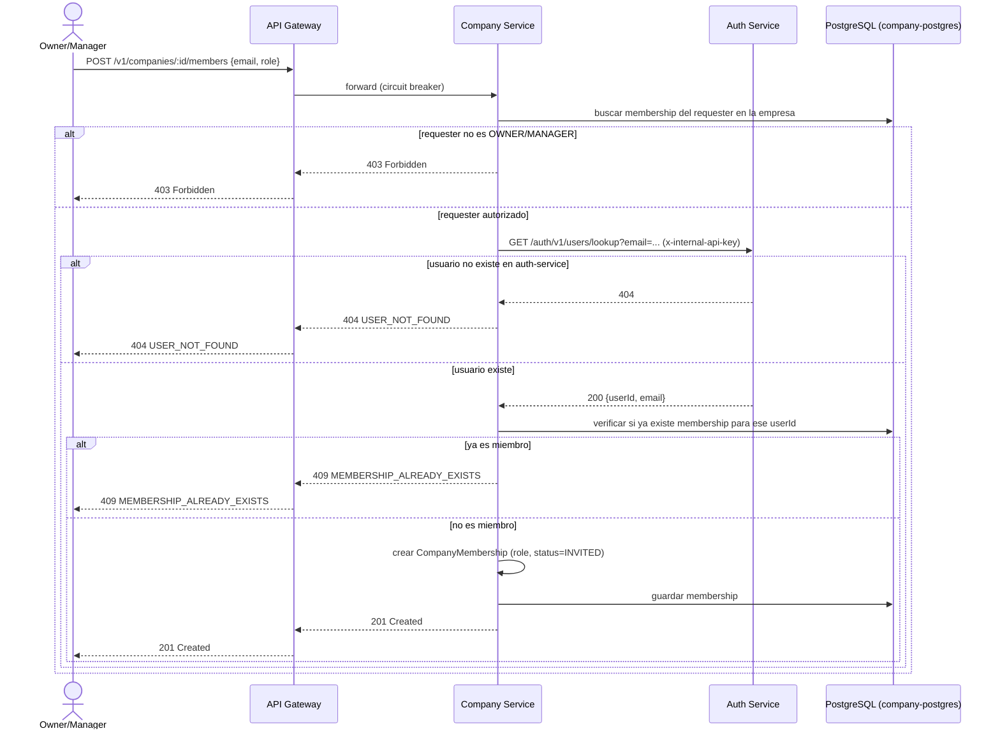

# Flujo de Invitar un Worker a una Empresa

## Pasos

1. Un `OWNER`/`MANAGER` de la empresa envía el email y rol del worker a invitar.
2. Company Service verifica que el requester tenga una membership activa con rol `OWNER` o `MANAGER` en esa empresa (`403` si no).
3. Company Service llama al endpoint interno de auth-service para resolver el `userId` a partir del email (ver [service-communication.md](service-communication.md)) — **no crea la cuenta**, el worker debe haberse registrado antes vía `/v1/auth/register`.
4. Si el email no corresponde a ningún usuario registrado, responde `404 USER_NOT_FOUND`.
5. Si ya existe una `CompanyMembership` para ese `userId` en la empresa, responde `409 MEMBERSHIP_ALREADY_EXISTS`.
6. En caso contrario, crea la `CompanyMembership` en estado `INVITED` con el rol solicitado.

## Nota sobre creación de empresa

El flujo de `POST /v1/companies` es más simple: no hay invitación — el
usuario autenticado que hace la petición queda automáticamente como
`OWNER`/`ACTIVE` de la nueva empresa (creación de `Company` + `CompanyMembership`
en una transacción). Ver [../architecture/company-service.md](../architecture/company-service.md).
