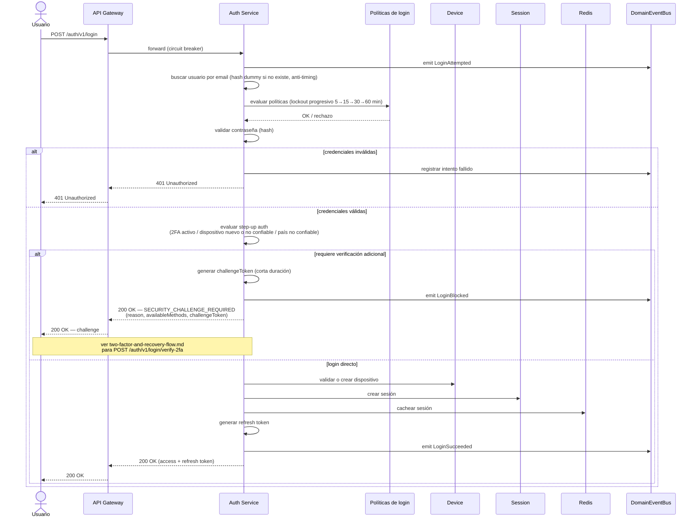

# Flujo de Inicio de Sesión

## Pasos

1. El usuario envía sus credenciales.
2. Se emite el evento `LoginAttempted`.
3. Se busca el usuario por email (con hash dummy si no existe, para no filtrar por timing si la cuenta existe).
4. Se evalúan las políticas de login (lockout progresivo por intentos fallidos).
5. Se valida la contraseña.
6. Se gestionan intentos fallidos (si la contraseña es inválida, se corta el flujo aquí).
7. Se evalúa si el intento requiere step-up auth (`LoginChallengeReason`): `TWO_FACTOR_REQUIRED`, `NEW_DEVICE`, `UNTRUSTED_DEVICE` o `UNTRUSTED_COUNTRY`.
8. Si requiere verificación adicional, se corta el login con el error de dominio `SECURITY_CHALLENGE_REQUIRED` — la respuesta incluye `availableMethods` (TOTP, recovery code, ...) y un `challengeToken` de un solo uso para completar el login sin repetir la contraseña. Ver [two-factor-and-recovery-flow.md](two-factor-and-recovery-flow.md).
9. Si no requiere verificación adicional: se valida o crea el dispositivo, se crea una sesión, se cachea en Redis y se genera un refresh token.
10. Se emite el evento `LoginSucceeded`.

Ver [../diagrams/auth-components.md](../diagrams/auth-components.md) para los componentes involucrados.
