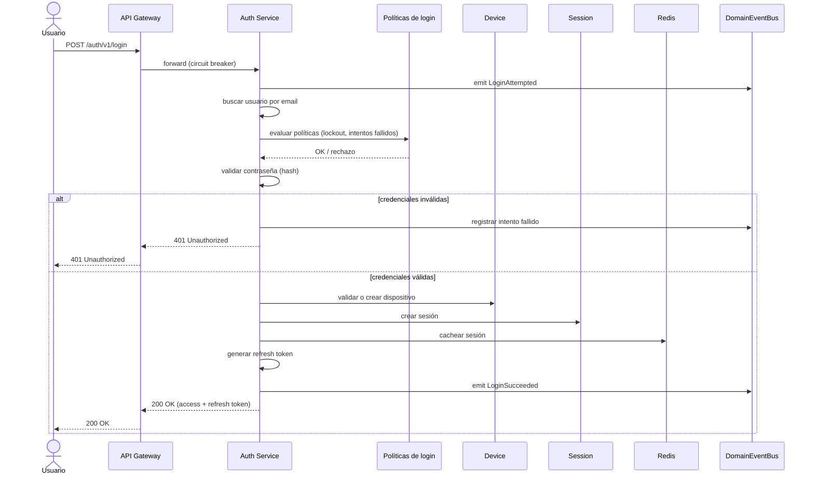

# Flujo de Inicio de Sesión

## Pasos

1. El usuario envía sus credenciales.
2. Se emite el evento `LoginAttempted`.
3. Se busca el usuario por email.
4. Se evalúan las políticas de login (lockout por intentos fallidos, etc.).
5. Se valida la contraseña.
6. Se gestionan intentos fallidos (si la contraseña es inválida, se corta el flujo aquí).
7. Se valida o crea el dispositivo.
8. Se crea una sesión.
9. Se genera un refresh token.
10. Se emite el evento `LoginSucceeded`.

Ver [../diagrams/auth-components.md](../diagrams/auth-components.md) para los componentes involucrados.
