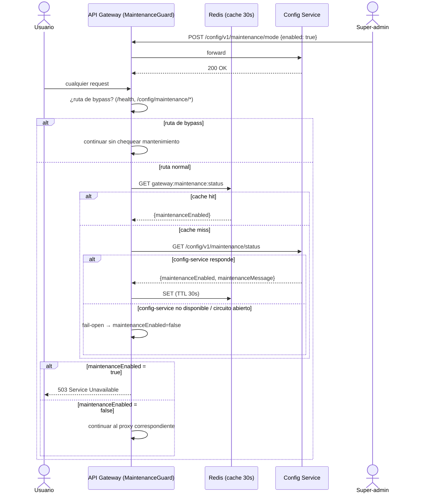

# Flujo de Modo Mantenimiento

## Resumen

- **Fuente de verdad**: `config-service`, vía `MaintenanceController` (`GET /maintenance/status`, `POST /maintenance/mode`, ventanas programables).
- **Enforcement**: `MaintenanceGuard` en el API Gateway, aplicado globalmente a todas las rutas salvo las de bypass.
- **Rutas de bypass** (con o sin prefijo de versión `/v1/`): `/health` y `/config/maintenance/*` — esta última para que un super-admin siempre pueda desactivar el mantenimiento incluso estando la plataforma "caída" para el resto de usuarios.
- **Cache**: Redis, clave `gateway:maintenance:status`, TTL 30 segundos — evita golpear config-service en cada request.
- **Política de fallo: fail-open**. Si config-service no responde (caído, timeout, circuito abierto), el guard **permite** el tráfico en vez de bloquear toda la plataforma por un fallo de la capa de configuración. Se loguea en el nivel apropiado según la causa (`WARN` si el circuito está abierto o hay un 5xx, `DEBUG` si es una simple caída de conexión en desarrollo).

Ver también [service-communication.md](service-communication.md) y el código: `services/api-gateway/src/infrastructure/security/guards/maintenance.guard.ts`.
