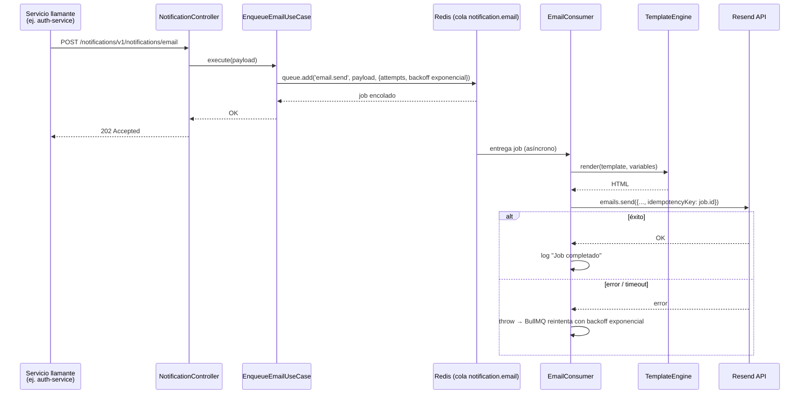
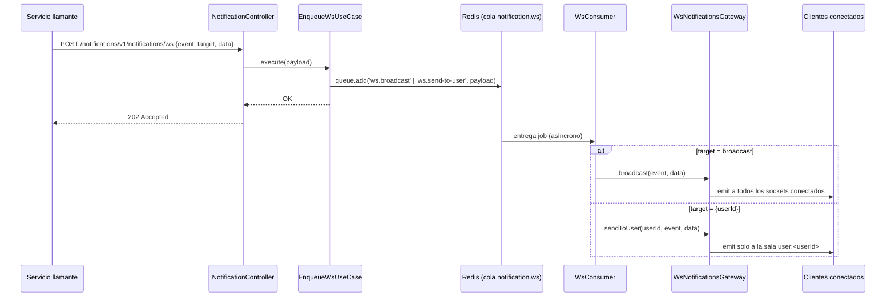
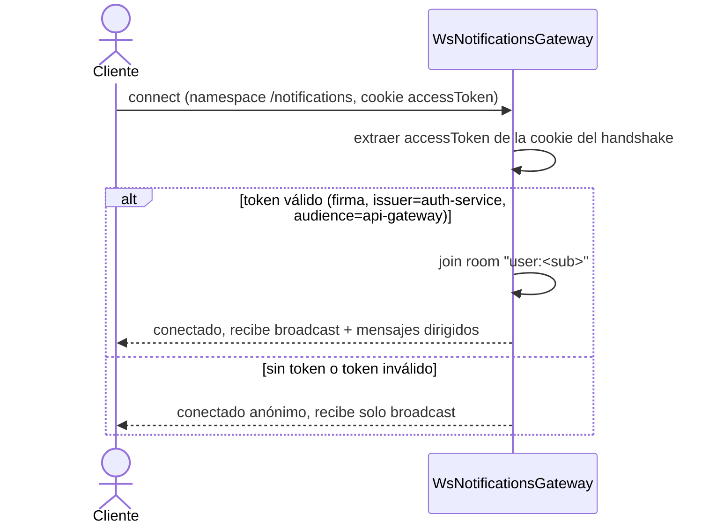

# Flujos del Notification Service

## Email transaccional

**Idempotencia**: `EmailChannel.send` pasa `job.id` (estable entre reintentos del mismo job) como `idempotencyKey` a Resend. Si un reintento ocurre después de que el correo ya se envió (por ejemplo, un timeout del lado nuestro que no canceló la petición HTTP en curso), Resend deduplica del lado del servidor y nunca envía el mismo correo dos veces.

**Timeout propio**: el SDK de Resend no soporta `AbortSignal`. `EmailChannel.withTimeout` corta la espera del lado del worker tras `RESEND_TIMEOUT_MS` para no dejar el worker de BullMQ bloqueado indefinidamente — no cancela la petición HTTP real, solo libera el worker para que BullMQ pueda reintentar.

## Notificación WebSocket

### Autenticación de la conexión WebSocket

El `userId` de la sala se deriva **siempre** del JWT verificado — nunca de un valor que el cliente declare — para que nadie pueda unirse a la sala de otro usuario e interceptar sus notificaciones dirigidas.

Ver también [service-communication.md](service-communication.md) y [../diagrams/notification-service-containers.md](../diagrams/notification-service-containers.md).
