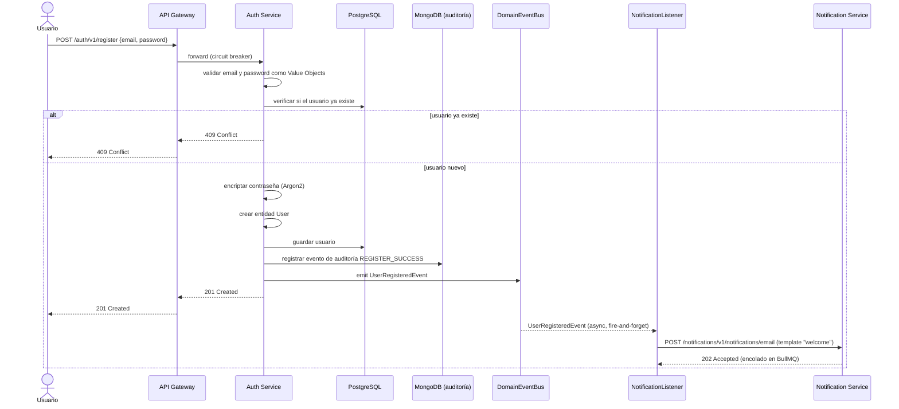

# Flujo de Registro de Usuario

## Pasos

1. El usuario envía email y contraseña.
2. Se validan como Value Objects (formato, fortaleza de contraseña).
3. Se verifica si el usuario ya existe.
4. La contraseña se encripta (Argon2).
5. Se crea la entidad `User`.
6. Se guarda el usuario en el repositorio (PostgreSQL vía Prisma).
7. Se registra un evento de auditoría `REGISTER_SUCCESS` en MongoDB.
8. Se emite `UserRegisteredEvent` en el `DomainEventBus` y la respuesta `201` se devuelve al cliente **sin esperar** el envío del email.
9. `NotificationListener` reacciona al evento de forma desacoplada y llama a `NotificationClient.sendEmail(...)`, que hace un `fetch` _fire-and-forget_ (con timeout, `NOTIFICATION_SERVICE_TIMEOUT`) hacia notification-service — un fallo aquí nunca revierte ni bloquea el registro.
10. Notification Service encola el email de bienvenida (template `welcome`, con link de verificación) en la cola BullMQ `notification.email` y responde `202 Accepted` de inmediato; el envío real es asíncrono (ver [notification-flows.md](notification-flows.md)).

Ver [../diagrams/auth-components.md](../diagrams/auth-components.md) para los componentes involucrados.
