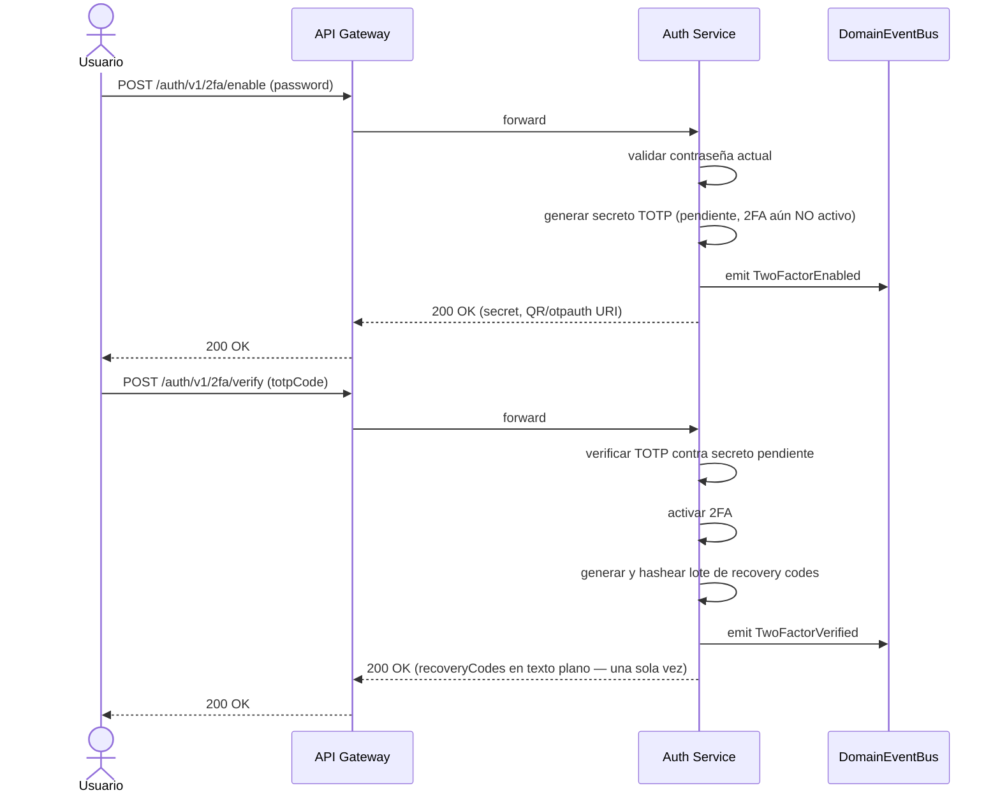
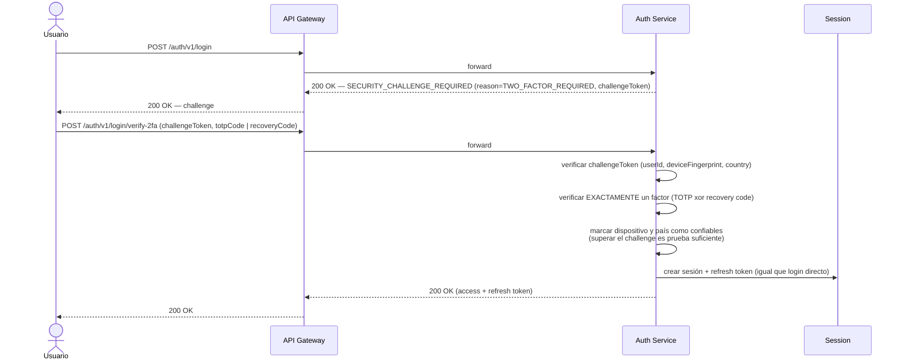
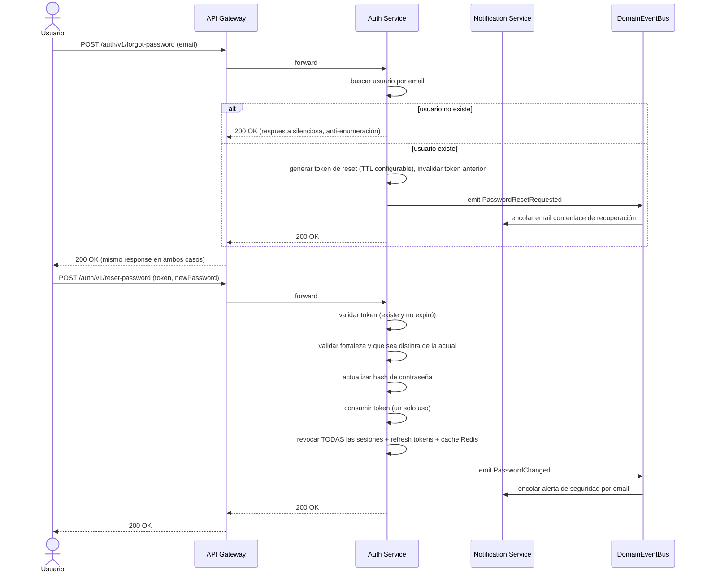

# Flujo de 2FA, Recovery Codes y Recuperación de Contraseña

## Activación de 2FA (TOTP)

- El secreto TOTP queda en estado "pendiente" hasta confirmarse con `2fa/verify`; 2FA no se activa solo con `2fa/enable`.
- Los recovery codes se devuelven en texto plano **una única vez**, en la respuesta de `2fa/verify` (y de `2fa/recovery-codes/regenerate`). El backend solo guarda sus hashes.

## Login con 2FA activo (resolución del challenge)

- `VerifyLoginChallengeUseCase` acepta un TOTP **o** un recovery code, nunca ambos a la vez.
- Un recovery code es de un solo uso: se invalida al consumirse.
- Al superar el challenge, el dispositivo/fingerprint y el país quedan marcados como confiables — logins futuros desde ese mismo origen no repiten el challenge por esa razón (aunque sí lo repetirán mientras 2FA siga activo, ya que `TWO_FACTOR_REQUIRED` no se "recuerda").

## Desactivar 2FA / regenerar recovery codes

- `POST /auth/v1/2fa/disable` y `POST /auth/v1/2fa/recovery-codes/regenerate` exigen **contraseña + TOTP vigente** (no basta con estar autenticado), ya que son operaciones que reducen o rotan la superficie de recuperación de la cuenta.
- Regenerar invalida completamente el lote anterior de recovery codes.

## Recuperación de contraseña (forgot / reset)

- `forgot-password` responde igual exista o no el email, para no revelar qué cuentas están registradas.
- `reset-password` reutiliza el mismo evento `PasswordChangedEvent` que `change-password` (mismo hecho de negocio desde la perspectiva de auditoría), y revoca todas las sesiones activas como medida de contención si el reset se debió a una cuenta comprometida.

Ver [../architecture/auth-service.md](../architecture/auth-service.md) para la lista completa de casos de uso y rutas, y [login-flow.md](login-flow.md) para el flujo de login base.
